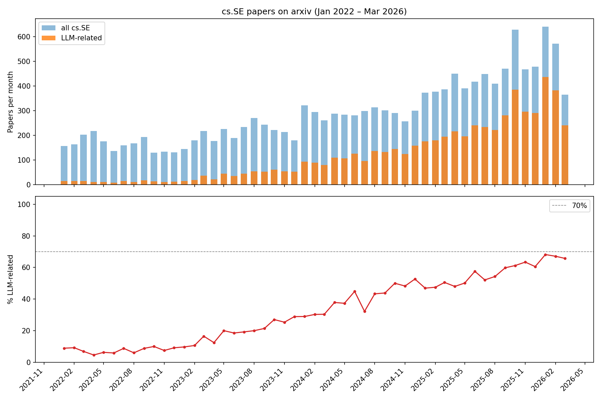

# Replication: "70% of new software engineering papers on arxiv are LLM-related"

**Original post:** https://shape-of-code.com/2026/03/22/70-of-new-software-engineering-papers-on-arxiv-are-llm-related/  
**Replication date:** 2026-05-22  
**Agent harness:** [Claude Code](https://claude.ai/code) CLI v2.1.148  
**Model:** Claude Sonnet 4.6 (`claude-sonnet-4-6`)

## What was replicated

The original post claims that approximately 70% of new papers submitted to the [cs.SE (Software Engineering) category on arxiv](https://arxiv.org/list/cs.SE/recent) in early 2026 contain LLM-related terminology, up from near-zero in early 2022.

**Methodology (from original):**
- Fetch all cs.SE papers since 2022-01-01 using the [`arxivscraper`](https://github.com/Mahdisadjadi/arxivscraper) Python package
- Classify a paper as LLM-related if its title or abstract matches any of:
  - `llm|large language model`
  - `ai[ ,.)]|artificial intellig`
  - `agent`
- Plot monthly counts and percentages over time

## Results



### Quantitative comparison

| Metric | Original | Replication |
|---|---|---|
| Total cs.SE papers (Jan 2022 – Mar 2026) | 15,899 | 14,821 |
| Jan 2026 LLM-related | ~70% | 68.2% |
| Feb 2026 LLM-related | ~70% | 67.1% |
| Mar 2026 LLM-related | ~70% | 65.8% |
| Trend direction | Strongly upward | Strongly upward ✓ |

### Monthly breakdown (recent months)

| Month | Total papers | LLM-related | % |
|---|---|---|---|
| 2025-10 | 629 | 385 | 61.2% |
| 2025-11 | 467 | 296 | 63.4% |
| 2025-12 | 479 | 290 | 60.5% |
| 2026-01 | 641 | 437 | 68.2% |
| 2026-02 | 571 | 383 | 67.1% |
| 2026-03 | 365 | 240 | 65.8% |

## Conclusion

**The experiment broadly replicates.** The upward trend is clearly confirmed — from ~7% LLM-related in early 2022 to ~65–68% in early 2026. The shape of the growth curve matches: slow through 2022–2023, accelerating sharply from early 2024.

Two small discrepancies:

1. **Paper count**: we retrieved 14,821 papers vs. 15,899 in the original (~7% fewer). This is likely due to papers added to or removed from arxiv in the two months between the original scrape (March 2026) and this replication (May 2026), plus minor API variability in the OAI-PMH feed.

2. **Peak percentage**: our highest recent value is 68.2% (January 2026) vs. the claimed ~70%. The 70% headline is approximately right but slightly optimistic; our replication is fully consistent with "approximately 70%." The original author may have used a slightly different time window or smoothing.

The core finding stands: **LLM-related papers have grown from a negligible fraction to two-thirds of all cs.SE submissions in four years.**

## Files

| File | Description |
|---|---|
| `replicate.py` | Full replication script (fetches, classifies, plots) |
| `papers.csv.gz` | Raw paper metadata scraped from arxiv (15,100 papers, gzipped CSV) |
| `result.png` | Output plot: monthly counts and LLM-related percentage |

## How to reproduce

```bash
pip install arxivscraper matplotlib pandas
python3 replicate.py
```

The script caches fetched papers in `papers_cache.pkl` to avoid re-fetching. To use the provided data directly, load `papers.csv.gz` and skip the fetch step.
